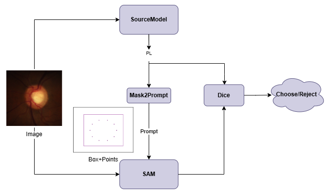

# Source-Free Domain Adaptation With Pseudo-Labeling Quality Assessed by SAM in Fundus Image Segmentation

Pytorch implementation of "Source-Free Domain Adaptation With Pseudo-Labeling Quality Assessed by SAM in Fundus Image Segmentation"

  

## Acknowledgement
This repo benefits from [BEAL](https://github.com/emma-sjwang/BEAL) and [SFDA-CBMT]https://github.com/lloongx/SFDA-CBMT
